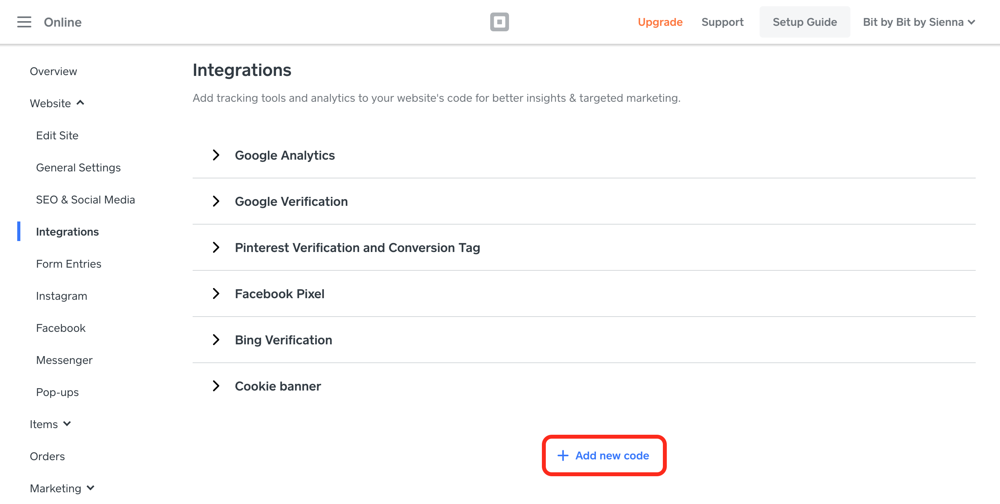
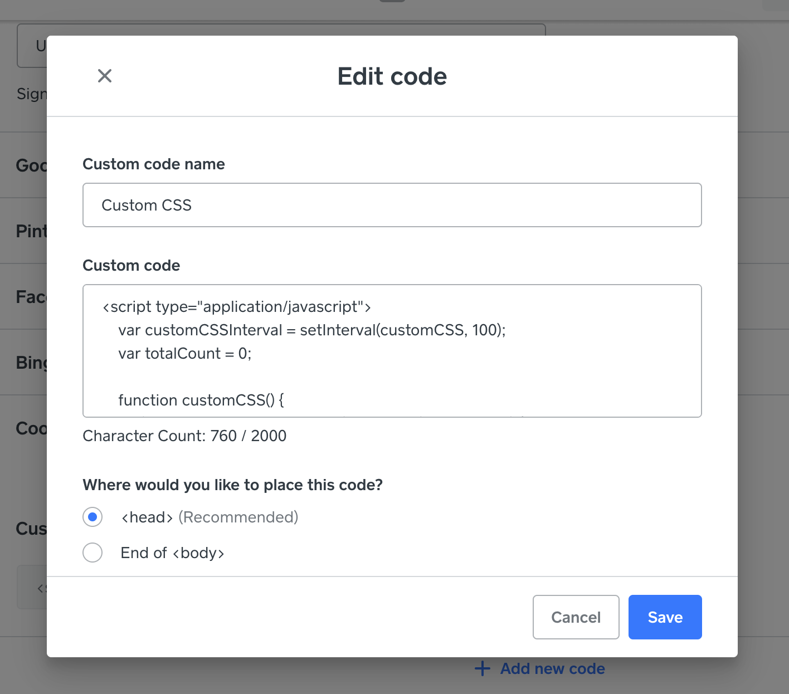

# Custom CSS for Square Online Store

We are using [Square](http://square.online/) for our online shop and, as of December 2020, they don't have an option for custom CSS.

But, they do have an option for custom Javascript!

So, we've developed an awesome hack to apply inline styles to certain elements after the page load, giving us total control over the shop design 😈 At least until they rename the internal element class names and break everything.

## Installing

To set up/update, navigate to **Website** > **Integrations**. Scroll to the bottom and click `+ Add new code`.

Title this `Custom CSS`, and paste in the Javascript. Select `<head>` so the code is executed sooner rather than later.

### Note:

You'll need to hit `Publish` after each change to the Javascript for it to take affect on the site.

You'll also need to load the proper site in order to see the changes. Editing on live, woo! 🎉

## How it works

The Javascript will be executed on every page load. Because we can't control if the Javascript will load before or after the elements we want to change, we poll every 10th of a second (100ms). We also accommodate for elements that might load *after* similar elements of that class have appeared on the page, so we will continue polling for another second, re-applying the inline style to all matching elements.

Once one second of polling is up (after the initial unlimited polling for the first element), we will cancel the polling and set the Javascript to bed 🛌😴💤

## Credit

If you found this hack useful, check out our store at https://bitbybitbysienna.com!
